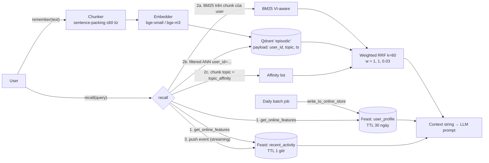

# Bonus — Hybrid Memory cho trợ lý AI cá nhân (tiếng Việt)

**Contributors:** Nguyễn Như Tài (2A202602976) — làm cá nhân, có dùng Claude Code (xem log cuối file).
**Chạy:** `python bonus/demo.py` (exit 0, ~40 s lần đầu do tải model fastembed).
**Code:** [`agent.py`](agent.py) (HybridMemoryAgent) · [`profile_store.py`](profile_store.py) (Feast) · [`demo.py`](demo.py) (5 query).

---

## 1. Sơ đồ kiến trúc



ASCII rút gọn (nếu Mermaid không render):

```
remember: text → chunk → embed → Qdrant(user_id payload)
recall:   Feast(profile 30d, activity 1h) ─┐
          BM25(user chunks) ───────────────┤→ weighted RRF → top-3 ─┐
          Qdrant filtered ANN(user_id) ────┤                        ├→ context → LLM
          affinity(topic == profile) ──────┘   profile + activity ──┘
          └→ push_activity() → Feast recent_activity (đọc được ngay lần sau)
```

---

## 2. Ba quyết định kiến trúc

### Quyết định 1 — Chunking: sentence-packing ≤ 60 từ (vs per-message vs per-conversation)

| Phương án | Retrieval quality | Storage | Context window |
|---|---|---|---|
| Per-message | Tốt cho chat ngắn; tin nhắn "ok", "ừ" thành vector rác | Nhiều vector nhất | Nhỏ |
| Per-conversation | Một vector trung bình hoá 10 ý → mờ, kém chính xác | Ít nhất | Một hit chiếm cả context |
| **Sentence-packing ≤ 60 từ** | Một ý/chunk, không cắt giữa câu | Trung bình | 3–5 chunk vừa prompt nhỏ |

**Chọn sentence-packing** vì nó giữ đơn vị ngữ nghĩa (câu) nguyên vẹn — câu tiếng Việt bị cắt giữa chừng làm cả BM25 lẫn embedding hỏng — trong khi vẫn đủ nhỏ để top-3 không vượt ~250 token. Đánh đổi: tốn nhiều vector hơn per-conversation (~3–5×), chấp nhận được vì memory cá nhân chỉ vài nghìn chunk/user. Không dùng overlap: với chunk theo câu, overlap chỉ nhân đôi trùng lặp trong top-k.

### Quyết định 2 — Feature schema: tabular features (vs embedding features)

| Feature view | Entity | Feature | TTL | Nguồn |
|---|---|---|---|---|
| `user_profile` | user | `preferred_language` (vi/en/mix), `reading_speed_wpm`, `topic_affinity`, `active_hours` | 30 ngày | batch hằng ngày |
| `recent_activity` | user | `queries_last_hour`, `recent_topics`, `late_night_ratio` | 1 giờ | push mỗi query |

**Chọn tabular** thay vì embedding feature ("vector sở thích" = trung bình embedding lịch sử) vì: (a) **giải thích được** — context ghi thẳng "User likes cloud" cho LLM và cho chính user (quyền được biết theo Nghị định 13/2023); (b) **sửa được** — user nói "tôi không còn quan tâm cloud" thì sửa 1 cột, còn vector trung bình thì không ai sửa tay được; (c) đổi embedding model không làm hỏng profile. Đánh đổi: mất sở thích tiềm ẩn đa chiều; chấp nhận vì sở thích đã nằm ngầm trong episodic memory rồi.

TTL bám đúng bài học NB4: activity TTL 1h nghĩa là sau 1 giờ không hoạt động, Feast trả `None` thay vì số cũ — agent in "(chưa có — activity TTL 1h đã hết)" chứ không bịa "bạn đang quan tâm X". Profile 30 ngày đủ sống qua một lần batch job lỗi.

**Profile dùng thế nào trong ranking — đo rồi mới chọn trọng số.** Tôi đưa `topic_affinity` vào làm retriever thứ 3 của RRF. Phiên bản đầu dùng trọng số 1.0 → hỏi "Tôi đã đọc gì về Kubernetes?" lại trả ghi chú cloud lên đầu, dù BM25 *và* vector đều xếp bài Kubernetes hạng 1. Nguyên nhân: với k=60 và chỉ ~10 chunk/user, rank 1 vs rank 2 chỉ chênh 1/61 − 1/62 ≈ 0.0003, nên một list phụ cộng thêm 1/61 ≈ 0.016 lật mọi thứ. Thử 0.3 vẫn lật. Tính ngược ra trọng số phải < ~0.05; chọn **0.03** → profile chỉ là *tie-breaker*. Kết quả: query 1 và 5 đúng, query 2 ("Recommend đọc gì tiếp", không có tín hiệu topic) vẫn ưu tiên chunk cloud ở hạng 2–3. Bài học: RRF k=60 được tune cho list hàng trăm doc; với memory cá nhân ngắn, mọi list phụ phải có trọng số nhỏ.

### Quyết định 3 — Freshness: hai tầng (streaming push + daily batch)

| Use case | Độ tươi cần | Cơ chế |
|---|---|---|
| "Tôi đang quan tâm gì gần đây?" | **sub-second** — câu hỏi vừa xong phải được tính | `write_to_online_store` (push) mỗi lần `recall` |
| Memory mới: "trợ lý nhớ gì về tài liệu tôi vừa đọc?" | **sub-second** — upsert Qdrant đồng bộ trong `remember` | Upsert trực tiếp, không qua batch |
| `topic_affinity`, `reading_speed_wpm` | **hằng ngày** — sở thích không đổi theo phút | Batch job → online store |

Demo chứng minh tầng streaming: query 1 thấy `0 queries`, query 2 thấy `1`, query 3 thấy `2` kèm `recent_topics=kubernetes` — mỗi event được push và đọc lại ngay lần gọi sau, không cần `materialize`. Đánh đổi: push mỗi query tốn một lần ghi SQLite/Redis (~1 ms) — rẻ hơn nhiều so với để user thấy câu trả lời "lỗi thời". Ngược lại, tính lại `topic_affinity` mỗi query sẽ làm profile dao động theo từng câu hỏi lẻ — vì vậy nó cố ý chậm (daily). Lưu ý: `recall` đọc feature **trước** khi push event của chính nó — đúng tinh thần point-in-time của NB4: feature tại thời điểm hỏi không được chứa chính câu hỏi đó.

---

## 3. Phương án đã loại bỏ

1. **Lưu episodic memory trong Feast (embedding feature view)** — loại. Feast online store là key-value theo entity: lấy được "vector của user u_001", không làm được ANN "top-k chunk gần query nhất". Chu kỳ cập nhật cũng khác hẳn: memory thêm mỗi phút, profile mỗi ngày. Tách Qdrant/Feast cho mỗi bên làm đúng việc của nó.
2. **Mỗi user một Qdrant collection** — loại. Cách ly mạnh, nhưng 1 triệu user = 1 triệu collection, mỗi cái có HNSW riêng → overhead bộ nhớ và quản trị. Chọn **một collection + payload `user_id` + filtered ANN** (đúng kỹ thuật NB5: filter nằm *trong* ANN nên recall giữ nguyên, không bị sập như post-filter). Demo kiểm tra cách ly: u_001 hỏi "doanh thu quý 3" không thấy memory của u_002. Đánh đổi: một bug quên filter = rò dữ liệu, nên filter được đặt cứng trong `_vector()`/`_keyword()`, không để caller tự truyền.

---

## 4. Ngữ cảnh tiếng Việt

* **Tách từ.** Tách theo khoảng trắng cho ra *âm tiết*, không phải *từ*: "tài liệu" → "tài" + "liệu", và "liệu" khớp nhầm "dữ **liệu**". Tôi không thêm pyvi/underthesea (nặng, chậm khi index), mà dùng **bigram âm tiết** (`tài_liệu`, `mở_rộng`) — xấp xỉ word segmentation, phrase match được thưởng điểm — cộng **stopword list** ("về", "gì", "tôi"…). Đánh đổi: index lớn ~2×, vẫn nhanh với memory cá nhân.
* **Gõ không dấu / lỗi Telex.** Mỗi token được phát thêm bản bỏ dấu (`tự_động` → `tu_dong`), nên "tu dong mo rong" vẫn khớp BM25.
* **Code-switching.** User VN viết "deploy", "autoscaling", "Recommend đọc gì tiếp". BM25 giữ nguyên token tiếng Anh nên bắt được thuật ngữ; `preferred_language=mix` báo cho LLM trả lời pha trộn tự nhiên.
* **Embedding model là nút thắt.** Query 4 ("Tài liệu về tự động mở rộng hạ tầng?") là paraphrase của memory "autoscaling… tự thêm máy khi lưu lượng tăng". `bge-small-en` xếp memory đó hạng 5 trong list vector (hạng 1 lại là ghi chú về Nghị định 13); nó chỉ leo lên hạng 2 chung cuộc nhờ BM25 khớp được vài âm tiết chung (hạng 2 list BM25), còn hạng 1 chung cuộc vẫn là ghi chú Nghị định 13 — sai. Đây đúng là kết quả NB2 (paraphrase: vector 24% < BM25 33%). Production phải dùng embedding đa ngữ: agent đọc `EMBEDDING_BACKEND` (`multilingual`/`bge-m3`), đổi model = re-index.
* **Quyền riêng tư (Nghị định 13/2023/NĐ-CP).** Memory hội thoại là dữ liệu cá nhân, có thể chứa dữ liệu nhạy cảm (sức khoẻ, tài chính). Cách ly theo `user_id` là tối thiểu; cần thêm quyền xoá (xem mục 5).

---

## 5. Những gì POC này chưa xử lý

* **CRUD trên memory**: chưa có `forget(memory_id)` — bắt buộc khi user yêu cầu xoá theo Nghị định 13.
* **Mã hoá at rest / per-user key**: Qdrant in-memory, SQLite không mã hoá.
* **Memory decay / consolidation**: memory sống mãi; chưa gộp 5 ghi chú tương tự thành 1 tóm tắt.
* **Persist & multi-device**: Qdrant `:memory:`, BM25 dựng lại mỗi query (O(n) theo số chunk của user — ổn đến vài nghìn chunk, không hơn).
* **Profile học từ hành vi**: `topic_affinity` đang được seed tay; batch job thật sẽ tính từ `recent_topics` tích luỹ (và phải dùng PIT join khi train, như NB4/NB8).
* **Activity log ở trong process**: nếu chạy nhiều replica, `queries_last_hour` phải tính bởi stream processor (Kafka/Flink) chứ không phải deque trong agent.

---

## 6. Vibe-coding log

* **Prompt hiệu quả nhất:** "In thứ hạng của từng retriever riêng cho query này" — thay vì đoán vì sao Kubernetes không lên top, debug cho thấy cả BM25 và vector đều xếp nó hạng 1, lỗi nằm ở trọng số RRF. Từ đó mới tính được ngưỡng < 0.05.
* **Prompt fail:** "Thêm profile vào ranking" — AI mặc định coi affinity là retriever ngang hàng (trọng số 1.0), demo trông vẫn "chạy" nhưng trả sai. Phải tự đặt tiêu chí kiểm tra (query 1 phải ra bài Kubernetes) mới phát hiện được.
